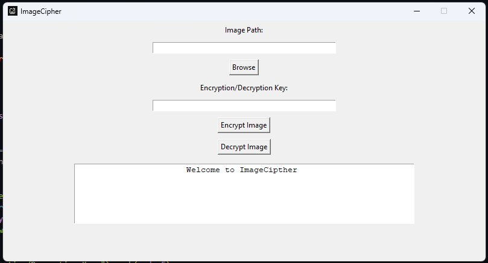

# ImageCipher

ImageCipher is a simple Python GUI application for encrypting and decrypting images using pixel manipulation. The application allows you to select an image, provide an encryption/decryption key, and then encrypt or decrypt the image.

## Features

- Encrypt images by manipulating pixel values.
- Decrypt images using the same key used for encryption.
- Easy-to-use graphical user interface (GUI) built with Tkinter.

## Prerequisites

- Python 3.x
- Pillow library for image processing
- NumPy library for numerical operations
- Tkinter for GUI (comes with standard Python installation)

## Installation

1. Clone the repository:
    ```bash
    git clone https://github.com/IamCOD3X/ImageCipher.git
    cd ImageCipher
    ```

2. Install the required libraries:
    ```bash
    pip install pillow numpy
    ```

## Usage

1. Run the application:
    ```bash
    python imagecipher.py
    ```

2. In the GUI:
    - Click on the "Browse" button to select an image file.
    - Enter an encryption/decryption key (must be an integer).
    - Click on "Encrypt Image" to encrypt the selected image.
    - Click on "Decrypt Image" to decrypt the selected image.

## Project Structure

- `imagecipher.py`: The main Python script containing the GUI and encryption/decryption logic.
- `assets/icon.png`: The icon for the application.
- `assets/screenshot/screenshot1.png`: The screenshot

## Screenshots



## License

This project is licensed under the MIT License - see the [LICENSE](LICENSE) file for details.

## Acknowledgments

- This project uses the Pillow library for image processing.
- GUI created using Tkinter.
